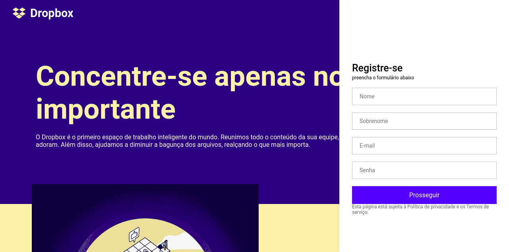
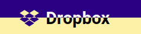

<h1 align="center">
  
  
</h1>

<h4 align="center"> 
	Dropbox Clone
</h4>

<p align="center">	
  

  <a href="https://www.linkedin.com/in/yuripalacio/">
    
  </a>
  
  <a href="https://github.com/yuripalacio/dropbox-clone/commits/master">
    
  </a>
  
  <a href="https://github.com/yuripalacio/mychat/blob/master/LICENSE">
    
  </a>
</p>

<p align="center">
  <a href="#sobre">Sobre</a>&nbsp;&nbsp;&nbsp;|&nbsp;&nbsp;&nbsp;
  <a href="#menu">Menu</a>&nbsp;&nbsp;&nbsp;|&nbsp;&nbsp;&nbsp;
  <a href="#header">Header</a>&nbsp;&nbsp;&nbsp;|&nbsp;&nbsp;&nbsp;
  <a href="#tecnologias">Tecnologias</a>&nbsp;&nbsp;&nbsp;|&nbsp;&nbsp;&nbsp;
  <a href="#referências">Referências</a>&nbsp;&nbsp;&nbsp;|&nbsp;&nbsp;&nbsp;
  <a href="#licença">Licença</a>
</p>

# Sobre

O projeto **Dropbox Clone** foi desenvolvido com objeto de estudo ampliando os conhecimentos com desenvolvimento Front-End entendendo novas funcionalidades.

Nessa aplicação clonamos parte da interface do site e funcionalidades do [Dropbox](https://www.dropbox.com/pt_BR/) como o menu e o efeito de mudança do header.

<h1 align="center">
  

  
</h1>

# Menu

Ao acessarmos o projeto, podemos verificar que o menu fica aberto a direita e conforme vamos "scrollando" a página ele some automaticamente.
Para criarmos este efeito foi necessário criar uma função que captura a posição do scroll no eixo Y e a partir de um determinado ponto (no caso definimos como 300) é alterado o estado de uma variável fazendo com que o menu recue.

Dentro do arquivo src/components/SideMenu/index.tsx
``` typescript
const scrollThreshold = 300; // Limite para o scroll

useEffect(() => {
    function onScroll() {
      setScrollY(window.scrollY);
      setIsActive(false);
    }

    window.addEventListener('scroll', onScroll);

    return () => window.removeEventListener('scroll', onScroll);
  }, []);
 
 // Quando o scroll é inferior ao limite definido, setamos 'scrollOpen' a classe
 const classes = [
    isActive ? 'open' : '',
    scrollY <= scrollThreshold ? 'scrollOpen' : '',
  ];
```

Dentro do arquivo src/components/SideMenu/styles.ts
``` typescript
@media (min-width: 1024px) {
  &.scrollOpen {
    transform: translateX(0);
  }

  &.scrollOpen .action--close {
    display: none;
  }
}
```

# Header

Para termos o efeito de mudança no cabeçalho tudo se resume na utilização `clip` fazendo com que os headers fiquem fixos em cada uma das suas respectivas sections e assim causando esse efeito.

Dentro do arquivo src/components/Section/styles.ts
``` typescript
export const HeaderWrapper = styled.div`
  ...
  clip: rect(auto, auto, auto, auto);
`;
```

# Tecnologias

- [Yarn](https://yarnpkg.com/)
- [React.js](https://pt-br.reactjs.org/)
- [Styled Components](https://styled-components.com/)
- [TypeScript](https://www.typescriptlang.org/)

# Referências

<p>
  https://www.youtube.com/watch?v=VqP1ECc_j4M
<p>

## Licença

Esse projeto está sob a licença MIT. Veja o arquivo <a href="https://github.com/yuripalacio/dropbox-clone/blob/master/LICENSE">LICENSE</a> para mais detalhes.

<hr />

By [Yuri Palacio](https://www.linkedin.com/in/yuri-palacio/) :wave:
